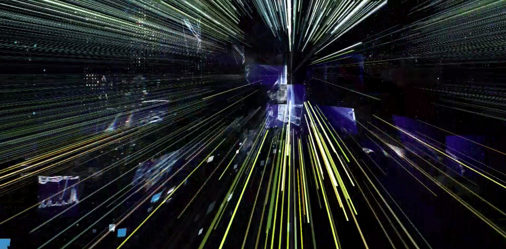

---
# You don't need to edit this file, it's empty on purpose.
# Edit theme's home layout instead if you wanna make some changes
# See: https://jekyllrb.com/docs/themes/#overriding-theme-defaults
layout: main
---
Basically we distribute [Super Pomoyka](http://super-pomoyka.us.to/trash/ttv-list/) acestream and proxy lists for their service [Torrent TV](https://torrent-tv.ru) wich brings `online`  rusian tv in HD. Besides we struggle scraping some links for the [beIN](https://bein.com) live streams working some [Kodi](http://www.beinsports.com/en/) addons like Picasso and Zem TV.

Here in the [Super Pomoyka](http://super-pomoyka.us.to/trash/ttv-list/) page, you will find many list that work 100% and they are updated every day so the links works. For the acestreams you are encouraged to download the ace-player from [this](http://acestream.org) site for the streams to be played.
<html>
	

		<tr><td>playlists for ace-player:</td><td>Link: <a href="http://super-pomoyka.us.to/trash/ttv-list">http://super-pomoyka.us.to/trash/ttv-list</a></td></tr>
						
<td><td></td> 
	
We specifically advise you to use the sport streams where you will be transported to a high new level of watching tv in HD. The downside is that you will never watch again tv streams in low resolution because now you know there is HD.
<html>
	
&nbsp;

	<section>
		<header>
			<h2>Live Score Widget</h2>
		</header>
		
We offer a live score service thanks to the live score widgets from <a href="//btfscores.com" rel="nofollow">btfscores.com</a>. They cover almost all football matches of the day around the world and you can follow the matches minute by minute. You find the live score widgets by clicking the links on the sidebar. Also if you are a webmaster you can click the apropiate link on the widget and get the widget on your web site.

		

	<section>
	
&nbsp;

	<section>
		<header><h2>Russian Football Premier League</h2></header>
	</section>
	
You can follow the russian league on Match! TV and of course with the live score system, the russian league presentation video clip is one of the best league video clip ever seen. Stay tune to Match! TV on matchdays to see this presentation clip. It's even better than french Ligue ONE presentation video.

	

	

<a href="//rgs.ru">RGS.ru</a>

	<!---->
	<!--
	-->
	
&nbsp;

